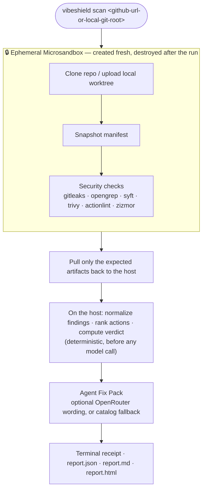

<div align="center">

# VibeShield

### Security autopilot for AI-generated code

**Point it at a repo. Get a short, inspectable Fix Pack — not a 200-alert dashboard.**

[](#-status--roadmap)
[](#-how-it-works)
[](package.json)
[](package.json)
[](docs/architecture.md)
[](docs/architecture.md)

</div>

---

> **The promise:** repo in -> a small Agent Fix Pack out.
>
> You shipped something an agent wrote. VibeShield helps you answer the only
> question that matters before you deploy it: **"Is there a real problem in here
> right now, and what should my coding agent fix first?"**

## Who this is for

A new wave of builders ship real web apps without reading most of the code their
AI agent wrote. They push to GitHub, wire up a database and a few API keys, and
hit deploy. They will not configure five AppSec tools or triage 40 findings, and
they should not have to.

VibeShield is built for them: **a security autopilot for beginner,
AI-generated web projects.** Not an enterprise AppSec platform. Not another
scanner wall. A tool that does the boring security legwork and hands back
something a non-expert, or their coding agent, can actually act on.

## What makes it different

- **Low noise is the product** — the goal is a few useful, prioritized actions,
  not a dashboard full of raw scanner output.
- **Facts before wording** — scanners, severity, priority, and verdict are
  deterministic. The model can improve the explanation, but it cannot change the
  result.
- **Untrusted code is treated as hostile** — repositories are scanned inside a
  fresh Microsandbox environment, then the sandbox is destroyed.
- **Everything is inspectable** — coverage, manifest, findings, and reports are
  plain files on disk.
- **Agent-ready output** — each action includes file/line evidence, why it
  matters, and a ready-to-paste prompt for your coding agent.

## What it is today

VibeShield is early-stage. The current product slice proves the deterministic
Quick Scan end to end.

| Today | Not yet |
| --- | --- |
| Local CLI: `vibeshield scan <repo>` | GitHub App / one-click install |
| Public GitHub URL or local Git worktree root | Private repos / zip upload |
| Secrets, dependency, workflow, IaC, SBOM, and code-pattern checks | Runtime validation |
| Truthful coverage: checked / skipped / failed / degraded | Continuous monitoring |
| Terminal + JSON + Markdown + HTML reports | PDF / web dashboard |
| Optional OpenRouter wording pass | Auto-fix or PR generation |

> [!IMPORTANT]
> VibeShield does not run your app. Authorization logic and runtime behavior are
> not checked yet. A green result means "looks OK for now from the checks that
> completed", not "secure".

## How it works



The untrusted repository is only ever read and executed **inside** the ephemeral
sandbox. The host operates on the extracted artifacts (manifest, scanner output),
never on the raw code, and the sandbox is destroyed when the run ends.

1. **Intake** — clone a public GitHub repo inside Microsandbox, or package a
   local Git worktree root with Git filtering and upload it into the sandbox.
2. **Snapshot** — record a small manifest: origin, commit SHA when available,
   file hashes, exclusions, source hash, tool versions, and DB freshness.
3. **Checks** — run the scanner toolchain inside the sandbox. If a check is not
   applicable, skipped, failed, or degraded, the report says so.
4. **Deterministic triage** — normalize evidence, group findings, rank actions,
   and compute the verdict before any model call.
5. **Fix Pack** — one optional OpenRouter call improves the explanation and
   prompt. If it is unavailable or invalid, the deterministic catalog fallback
   is used.

## Quickstart

**Requirements:** Node >= 24, pnpm 10, Docker or Podman, and
[Microsandbox](https://github.com/microsandbox/microsandbox).

```bash
# 1. Install
pnpm install

# 2. Optional: enable model-polished Fix Pack wording
cp .env.example .env
# set OPENROUTER_API_KEY in .env
# without it, VibeShield still runs with the catalog fallback

# 3. Build and load the scanner toolchain
pnpm toolchain:prepare

# 4. Scan a repo
pnpm scan https://github.com/owner/repo
# or
pnpm scan /path/to/local/git-worktree-root
```

That is the intended setup path. The toolchain command builds the local scanner
image and loads it into Microsandbox.

## What you get back

The terminal output is a short receipt, not the whole report:

```text
  ◆ VibeShield  github.com/acme/widget-shop @ abc123def456

  ✗ Critical fix needed
    2 fixes to make before you ship. Start with the first one.

  Full report
    ~/.vibeshield/runs/<run-id>/report.html ← open in a browser
    Markdown and JSON are in the same folder.

  This scan did not run your app; authorization logic and runtime behavior were not checked.
```

The HTML report is the human-readable Fix Pack. Each fix has a clearly marked
**Prompt for your coding agent** block to copy and paste.

The inspectable run artifacts live under `~/.vibeshield/runs/<run-id>/`:

```text
manifest.json
report.json
report.md
report.html
```

## Tech stack

- **Language / runtime:** TypeScript on Node >= 24, ESM.
- **Sandbox:** Microsandbox.
- **Models:** optional remediation wording via OpenRouter.
- **Scanners:** gitleaks, opengrep, syft, trivy, actionlint, zizmor.
- **Tooling:** pnpm · tsx · vitest · Biome.

Design philosophy: **boring, inspectable code over clever orchestration**. See
[AGENTS.md](AGENTS.md) for repo conventions.

## Status & roadmap

This is an experimental MVP focused on proving the detection core.

- **Now** — deterministic Quick Scan, truthful coverage, Agent Fix Pack,
  inspectable local artifacts.
- **Next** — minimal resume from durable run state.
- **Later** — private repos, validated findings, PDF/web report, GitHub
  integration, and eventually low-friction continuous monitoring.

## Local development

```bash
pnpm install
pnpm toolchain:prepare
pnpm lint
pnpm typecheck
pnpm test
pnpm exec tsx src/cli.ts --help
```

The default test suite uses `FakeSandboxRuntime`; it does not boot a VM. The
live Microsandbox smoke test is skipped by default and can be run explicitly
after the toolchain image is ready:

```bash
pnpm exec vitest run tests/microsandbox-runtime.smoke.test.ts
```

## Documentation

| Doc | What's inside |
| --- | --- |
| [docs/architecture.md](docs/architecture.md) | Architecture notes |
| [docs/stage-1-deterministic-security-core-plan.md](docs/stage-1-deterministic-security-core-plan.md) | Current Stage 1 implementation plan |
| [AGENTS.md](AGENTS.md) | Repository conventions for humans and coding agents |

---

<div align="center">

**VibeShield** · early-stage · built with care for people who ship faster than they can review.

</div>
