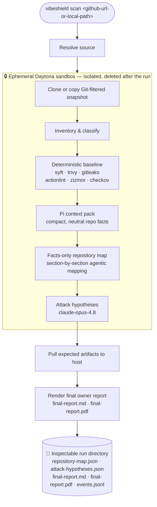

<div align="center">

# 🛡️ VibeShield

### Security autopilot for AI-generated code

**Point it at a repo. Get an inspectable security read-out — not a 200-alert dashboard.**

[](#-status--roadmap)
[](#-how-it-works)
[](package.json)
[](package.json)
[](docs/architecture.md)
[](docs/architecture.md)

</div>

---

> **The promise:** repo in → inspectable run artifacts out.
>
> You shipped something an agent wrote. VibeShield helps you answer the only question that matters before you deploy it: **"Is there a hole in here right now?"**

## 🎯 Who this is for

A new wave of builders ship real web apps without reading most of the code their AI agent wrote. They push to GitHub, wire up a database and a few API keys, and hit deploy. They won't install Snyk, configure CodeQL, or triage 40 security alerts — and they shouldn't have to.

VibeShield is built for them: **a security autopilot for beginner, AI-generated web projects.** Not an enterprise AppSec platform. Not another scanner wrapper. A tool that does the boring security legwork and hands back something a non-expert (or their coding agent) can actually act on.

## ✨ What makes it different

- 🧠 **AI-native, two-stage triage** — deterministic scanners first, then agentic repository mapping, then prioritized *attack hypotheses*. Cheap checks gate expensive models.
- 🔒 **Untrusted code is treated as hostile** — every scanned repo runs inside a fresh, network-isolated [Daytona](https://www.daytona.io/) sandbox that is destroyed when the run ends. Nothing hostile ever touches your host.
- 🧾 **Facts before verdicts** — VibeShield builds an evidence-backed map of *what the code actually is* before anyone reasons about *what could go wrong*. Every fact is named and traceable to a file.
- 📉 **Low noise is the product** — the goal is 3–7 useful, prioritized signals, not a wall of findings. Honesty over coverage.
- 📂 **Everything is inspectable** — every stage writes plain JSON and Markdown to disk. No black box; `cat` the artifacts and see exactly what happened.

## ⚠️ What it is (and isn't) — today

VibeShield is **early-stage**. The current product slice proves one thing end-to-end: the scan pipeline.

| ✅ Today | 🚧 Not yet |
| --- | --- |
| Local CLI: `vibeshield scan <repo>` | GitHub App / one-click install |
| Deterministic baseline scanners | Auto-fix or PR generation |
| Facts-only AppSec **repository map** | Continuous monitoring |
| Prioritized **attack hypotheses** | A web dashboard or accounts |
| Inspectable run artifacts on disk | Confirmed, validated findings |

> [!IMPORTANT]
> The repository map and attack hypotheses are **navigation aids, not a security verdict.** Hypotheses are *testable leads*, not confirmed vulnerabilities. Confirmation comes later, after validation.

## 🛠️ How it works



1. **Intake** — resolve a GitHub URL or local Git worktree root, materialize it *inside the sandbox*, and build an inventory of languages, manifests, and structure. Local paths use Git-filtered snapshots: tracked files plus untracked files that are not ignored by `.gitignore`, `.git/info/exclude`, or global Git excludes.
2. **Deterministic baseline** — run fast, boring, well-understood scanners (SBOM, vulnerabilities, secrets, CI/IaC linting). A single tool failing never sinks the run.
3. **Context pack** — distill the repo into compact, neutral facts for the agents — no raw scanner noise, no debug spam.
4. **Repository map** — agentic "Pi" collectors map the codebase section by section (entrypoints, auth, config & secrets, storage, integrations, operation sinks, data flows, trust boundaries, …). Each fact is **named** and backed by the file it was observed in.
5. **Attack hypotheses** — a strong model (`claude-opus-4.8`) reads the accepted map — *not* the raw code — and proposes a prioritized list of testable attack hypotheses.
6. **Final report & cleanup** — pull the expected artifacts back to the host, render a short owner-facing **Security Report** (Markdown + styled PDF), and destroy the sandbox.

See [docs/architecture.md](docs/architecture.md) for the full flow and [docs/repository-map-expectations.md](docs/repository-map-expectations.md) for what each map section must contain.

## 🚀 Quickstart

**Requirements:** Node ≥ 24, [pnpm](https://pnpm.io/), and API keys for [Daytona](https://www.daytona.io/) + [OpenRouter](https://openrouter.ai/) (for live scans).

```bash
# 1. Install
pnpm install

# 2. Configure credentials
cp .env.example .env
#   then set DAYTONA_API_KEY and OPENROUTER_API_KEY in .env
#   (DAYTONA_API_URL and DAYTONA_TARGET are optional SDK overrides)

# 3. Scan a repo
pnpm scan https://github.com/owner/repo
# or
pnpm scan /path/to/local/git-worktree
```

A live scan **requires** both keys and will fail clearly if they're missing — it never falls back to cloning an untrusted repo on your host. Results land in a fresh run directory under `runs/`.

> 💡 **A run died midway?** Resume it from durable artifacts — no need to redo finished work:
> ```bash
> pnpm resume runs/<run-directory>
> ```
>
> Resume reuses every accepted artifact and only reruns what's missing. To force a rerun from a
> named step — any single map section (e.g. `entrypoints`, `auth-access`, `data-flows`) plus
> `inventory`, `deterministic-baseline`, `context`, `repository-map`, `attack-hypotheses`, or
> `final-report` — pass `--from`:
> ```bash
> pnpm resume runs/<run-directory> --from auth-access
> pnpm resume runs/<run-directory> --from attack-hypotheses
> pnpm cli -- --help            # lists every resume step and its aliases
> ```
>
> To rerun exactly one step and leave downstream artifacts untouched, use `--only`:
> ```bash
> pnpm resume runs/<run-directory> --only entrypoints
> pnpm resume runs/<run-directory> --only final-report
> ```
>
> `--only` is best-effort: the selected step uses whatever accepted inputs already exist and
> fails clearly if its basic inputs are missing. A successful `--only` on a failed run does not
> turn the overall run into `success`; `--only final-report` only renders for a run that already
> completed successfully.

## 📂 What a run produces

Every run writes a self-contained, inspectable directory. The highlights:

```text
final-report.md                 # owner-facing report source
final-report.pdf                # owner-facing PDF report
run.json                        # run status, repo, commit SHA
events.jsonl                    # sanitized lifecycle event stream
outputs/
├─ inventory.json               # languages, manifests, structure
├─ baseline-summary.json        # concrete deterministic findings
├─ pi-context-pack.json         # compact facts handed to the agents
├─ repository-map.json          # the synthesized facts-only map
├─ attack-hypotheses.json       # prioritized, testable leads
└─ repo-map/                    # one JSON artifact per map section
   ├─ entrypoints.json
   ├─ auth-access.json
   ├─ config-secrets.json
   ├─ storage-data-model.json
   ├─ operation-sinks.json
   ├─ data-flows.json
   └─ … (coverage, stack, crypto, infra, integrations, logging, trust-boundaries)
```

**The report itself** is short and owner-facing — the same content in `final-report.md` and a styled `final-report.pdf`. It opens with a plain-language **summary** of what the repo is and where risk concentrates, a quick metric strip (finding counts, top severity), then:

- 🧮 **Deterministic scanner findings**, grouped by severity (critical → low), each with its evidence and confidence.
- 🎯 **Attack hypotheses**, grouped by priority (`P0` critical → `P3` low). Every hypothesis spells out why it matters, where to look, the attack vector, how to check it, and what to fix if confirmed — each traceable back to the map evidence it came from.

<details>
<summary><b>Why a sandbox? (the threat model)</b></summary>

<br/>

Repositories that VibeShield scans are **untrusted input** — they may be malicious, and their content can attempt prompt injection against the analysis agents. So the design is defensive by default:

- Each scan gets a **fresh, isolated Daytona sandbox**; the repo is cloned and all scanners + agents run *there*, never on the host.
- The host only pulls back a known set of **expected artifacts** — not arbitrary files.
- The sandbox is **deleted** after both success and failure.
- Agents reason over a **curated context pack**, run read-only, and the hypothesis stage gets the map — not raw repository inspection tools.

The host's job is orchestration, artifact storage, and reporting. It must never clone or execute the scanned repo directly when live credentials are present.

</details>

## 🧱 Tech stack

- **Language / runtime:** TypeScript on Node ≥ 24, ESM.
- **Sandbox:** [`@daytona/sdk`](https://www.daytona.io/) — ephemeral, isolated execution.
- **Models:** routed via [OpenRouter](https://openrouter.ai/); attack hypotheses use `claude-opus-4.8`.
- **Baseline scanners:** syft (SBOM), trivy, gitleaks, actionlint, zizmor, checkov.
- **Tooling:** pnpm · tsx · vitest · Biome.

Design philosophy: **boring, inspectable code over clever orchestration** — KISS, DRY, YAGNI. Behavior should be easy to debug straight from files on disk. See [AGENTS.md](AGENTS.md).

## 🗺️ Status & roadmap

This is an MVP focused on proving the detection core. Where it's heading:

- **Now** — local CLI, facts-only map + attack hypotheses, inspectable artifacts.
- **Next** — a beginner-friendly **Security Snapshot**: a `Safe to demo / Unsafe to deploy / Critical fix needed` status with a handful of cards, each explaining the risk in plain language and including a ready-to-paste prompt for your coding agent.
- **Later** — validated findings (hypothesis → evidence → confirmation), and eventually a low-friction GitHub integration.

## 🧑‍💻 Local development

```bash
pnpm install
pnpm lint         # Biome
pnpm typecheck    # tsc --noEmit
pnpm test         # vitest
pnpm cli -- --help
pnpm resume runs/<run-directory> --from attack-hypotheses
pnpm resume runs/<run-directory> --only entrypoints

# Live smoke tests (require credentials)
pnpm smoke:daytona     https://github.com/octocat/Hello-World
pnpm smoke:pi-daytona  https://github.com/owner/repo
```

Tests use a **fake Daytona adapter** (`src/sandbox/fake-daytona.ts`) as a local double — non-live acceptance tests don't need credentials or network access.

Conventions, commit hygiene, and engineering principles live in [AGENTS.md](AGENTS.md).

## 📚 Documentation

| Doc | What's inside |
| --- | --- |
| [docs/architecture.md](docs/architecture.md) | End-to-end flow, sandbox boundary, pipeline, artifacts |
| [docs/repository-map-expectations.md](docs/repository-map-expectations.md) | The evidence contract for each map section |
| [docs/idea.md](docs/idea.md) | Product vision and positioning |
| [docs/mvp-plan.md](docs/mvp-plan.md) | MVP plan |
| [AGENTS.md](AGENTS.md) | Repository conventions for humans and coding agents |

---

<div align="center">

**VibeShield** · early-stage · built with care for people who ship faster than they can review.

</div>
