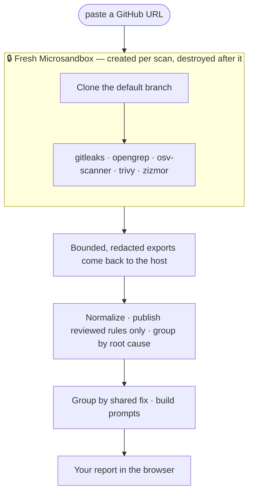

<div align="center">

# VibeShield

### Security checks for repos you didn't read line by line

**Paste a GitHub link. Get a short list of things to fix, each with a prompt for your coding agent.**

[](#status)
[](#how-it-works)
[](package.json)
[](package.json)
[](docs/architecture.md)

</div>

---

> You shipped something an agent wrote. VibeShield answers the one question that
> matters before you put it online: **is there a real problem in here right now,
> and what should I fix first?**

## Who this is for

People who build real web apps without reading most of the code their AI agent
wrote. They push to GitHub, wire up a database and a few API keys, and deploy.
They will not configure five AppSec tools or triage forty alerts, and they
should not have to.

## What it does

You paste a public GitHub repository URL. VibeShield copies the repository into a
throwaway sandbox, runs five security checks on it, destroys the sandbox, and
gives you a short list of jobs to do. Each job says where it is, why it matters,
what to change, how to check your work, and carries a prompt you can paste into
Cursor or Claude Code.

| Check | What it looks for |
| --- | --- |
| Gitleaks | Keys and passwords in your files and in the last 100 commits |
| OpenGrep | Code where outside input reaches something dangerous |
| OSV-Scanner | Packages you install that have known security bugs |
| Trivy | Container and infrastructure configuration |
| zizmor | GitHub Actions workflows |

**What it does not do.** Your app is never started, so logins, permissions and
payments go untested. Business logic is out of scope: a route that returns
another user's data looks like ordinary code to every check here. There is no
score and no green light to deploy. An empty result means the checks that ran
found nothing, which is not the same as being safe.

## What makes it different

- **Low noise is the product.** Running more checks must not mean more alerts.
  Only reviewed rules with a concrete fix and real evidence reach you; the rest
  are counted and reported as a number.
- **One card is one change.** Nine flows fixed by the same validation are one
  job with nine locations, not nine cards.
- **The machinery stays out of the way.** Tool names, versions, rule and advisory
  identifiers, coverage states and provenance are on the page, inside
  disclosures, not in the first screen.
- **Untrusted code is treated as hostile.** Every scan gets a fresh Microsandbox,
  and it is destroyed when the run ends.
- **No model decides anything.** Selection, publication, grouping, ordering and
  wording are deterministic.
- **A scan that starts finishes.** It ends with your report, or with a named
  reason and something to do about it.

## How it works


```mermaid
flowchart TD
    A(["paste a GitHub URL"]) --> SBX

    subgraph SBX["🔒 Fresh Microsandbox — created per scan, destroyed after it"]
        direction TB
        S["Clone the default branch"] --> C["gitleaks · opengrep · osv-scanner · trivy · zizmor"]
    end

    SBX --> PULL[Bounded, redacted exports come back to the host]
    PULL --> T["Normalize · publish reviewed rules only · group by root cause"]
    T --> P["Group by shared fix · build prompts"]
    P --> O["Your report in the browser"]
```

## Run it

**Requirements:** Node ≥ 24, pnpm 10, Docker or Podman, and
[Microsandbox](https://github.com/microsandbox/microsandbox).

```bash
pnpm install
pnpm toolchain:prepare
pnpm build
pnpm start
```

Open `http://127.0.0.1:3000`. Use `pnpm dev` while working on it.

`HOST` takes an IP address or `localhost` (default `127.0.0.1`) and `PORT` takes
1–65535 (default `3000`). Binding to a private network is an explicit operator
choice: there is no application authentication, no accounts, and no public
multi-user hosting in this slice. One scan runs at a time. Results live in memory
for one hour and do not survive a restart.

See [docs/private-web-browser.md](docs/private-web-browser.md) for routes,
operator diagnostics and the acceptance commands.

## Tech stack

- **Language / runtime:** TypeScript on Node ≥ 24, ESM, no web framework.
- **Sandbox:** Microsandbox, one pinned toolchain image.
- **Scanners:** gitleaks, opengrep, osv-scanner, trivy, zizmor.
- **Tooling:** pnpm · tsx · vitest · Biome.

Design philosophy: **boring, inspectable code over clever orchestration.** See
[AGENTS.md](AGENTS.md) for repository conventions.

## Status

Experimental. The service works end to end and is deliberately narrow.

- **Now** — one public repository at a time, five checks, a grouped report with
  agent prompts, honest coverage.
- **Not yet** — private repositories, accounts, saved history, continuous
  monitoring, pull requests, auto-fix.

The earlier CLI pipeline and its deep-static experiment are still in the tree
with their tests and their `pnpm scan` / `pnpm resume` scripts. They are not part
of the product and not a current promise; see
[docs/architecture.md](docs/architecture.md).

## Local development

```bash
pnpm check      # lint, typecheck, tests, build
pnpm test:live  # real engines in Microsandbox, needs the prepared image
```

The fast suite uses controlled scanner outputs at the sandbox boundary; it does
not boot a VM. `pnpm test:live` is a separate, serial, mandatory check that runs
all five real engines and submits a public repository through the real
composition.

## Documentation

| Doc | What's inside |
| --- | --- |
| [docs/architecture.md](docs/architecture.md) | How the service is put together |
| [docs/private-web-browser.md](docs/private-web-browser.md) | Pages, routes, diagnostics, acceptance |
| [docs/private-web-code-rules.md](docs/private-web-code-rules.md) | The selected code rules and why |
| [docs/private-web-dependencies.md](docs/private-web-dependencies.md) | Lockfile and advisory handling |
| [docs/private-web-config.md](docs/private-web-config.md) | Container and infrastructure checks |
| [docs/private-web-workflows.md](docs/private-web-workflows.md) | GitHub Actions checks |
| [docs/runtime-limits.md](docs/runtime-limits.md) | Sandbox lifecycle and enforced limits |
| [docs/benchmark-methodology.md](docs/benchmark-methodology.md) | How quality is measured, and what passing tests do not prove |
| [AGENTS.md](AGENTS.md) | Repository conventions for humans and coding agents |

---
